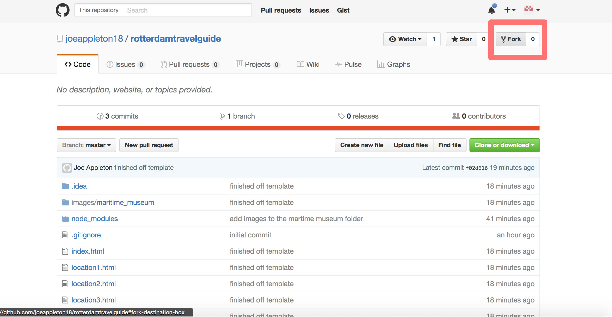
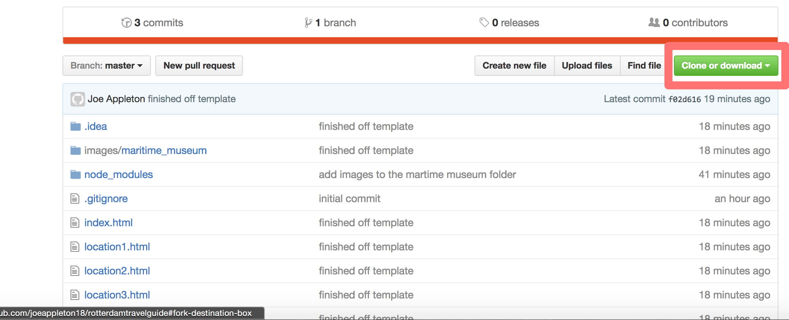

#Git Collaboration 

The purpose of this practical is to simulate how a collaborative git work flow would operate in the real word.

Using your local knowledge you are going to create a visit Rotterdam Website. 

	
#Setup

We're going to use git to collaborate on this project. Firstly install git on your local computer:

[instructions can be found here](https://git-scm.com/book/en/v2/Getting-Started-Installing-Git)


Once install if you are on a mac open up terminal, on windows open up git bash.  


###Set up your user details 

```
git config --global user.name "Your Name Comes Here"
git config --global user.email you@yourdomain.com
```

**You can check your config with**

You can check your configuration with:

``git config --list``


##Form Teams 


- Nominate a team leader **you can form one group or use smaller sub groups**. Ideally the team leader would have used git and gitHub before

- [The team leader needs to download my starter project](https://github.com/sirus21/rotterdamtravelguide/archive/master.zip)

- The downloaded zip file needs to be unzipped



- Next, the team leader should navigate to the decompressed folder

  - Navigate on command line to where you want to work:  (using terminal or gitBash) 

   			```
   			cd   <directory name>    //to change directory 
   			cd    ..      //to move up one directory 
   			
   			```  
   	**or**
   			
   You can type `cd` then drag the folder into the terminal/gitBash window. 
   
 - Next, the team leader must create a new repository: 

 ```
    git init 
    git add -A
    git commit -m "initial commit"
 ```  

- The team leader should then create a new repository on `gitHub`. Git hub will provide instructions on how to add an exciting project. 

- The team leader should grant access to the repository to everyone else in the team. This can be done from the repository settings  


- Everyone in the team should then clone the repository to their local computer. 

-  
>> get the repository address by prising the clone button 

  - Type `git clone <projectadress>` and press enter 
  - A new folder called `rotterdamtravelguide` should be created containing the starter project.
  - Type `cd rotterdamtravelguide` and press enter in order to navigate into that project folder. 
  

 
 #The Task 
 
  
 - As a team pick out one attraction each to write about. This can be anything that takes their fancy. 

 - Each team member should then create a new branch, so they can work on their attraction in isolation. To create a new branch type:

 ```
   git checkout -b "branch_name"
 
 ```
 >> Note, branch names can not contain spaces.
 
 - This will create a new branch and switch to it. If you type  `git branch` you should see you are on your relevant branch 

 - Updated the html pages relating to your chosen attraction.  
 	- Commit regularly 
 	
 	```
 	  git add -A
 	  git commit -m "this is a commit message"
 	```

   - If you make a mistake:

   ```
    git reset --hard
   		
   ```
   >> resets the head to the last commit 
   
 #Pull requests 
   
 - When each team member feels they has finished their section they should push their features branch to the github origin  origin 


 ```
   git push --set-upstream origin <the name of your branch>	
```

- The team member should then locate their branch on gitHub and raise a pull request.

- If the team leader is happy with the pull request, he should merge it into the project.

- The team member should switch back to the master branch and pull the latest changes:

``` 
git checkout master
git pull origin master

```


**Optional if we have time**

- Publish you website using gitHubPages 
(More Here)[https://pages.github.com/]

- Create a new repository on gitHub called <username>.github.io

- Get the remote address and assign it to a remote called website. This is what my command will look like:

-  `git remote add website  https://github.com/joeappleton18/joeappleton18.github.io.git`  

>> this 


